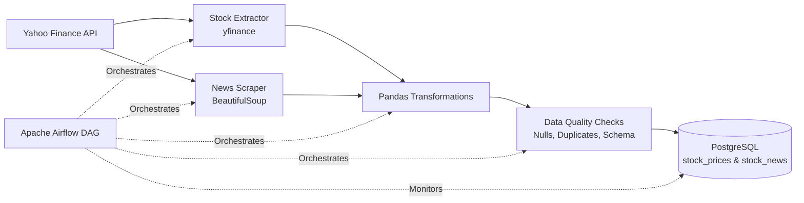

# 📊 Automated Stock & News Data Pipeline

> **Production-ready ETL pipeline** extracting stock prices and financial news from Yahoo Finance, orchestrated with Apache Airflow

[](https://www.python.org/)
[](https://airflow.apache.org/)
[](https://www.postgresql.org/)
[](https://www.docker.com/)

**Author:** Suraj Kumar | [LinkedIn](https://linkedin.com/in/suraj-kumar-0700ba193) | [GitHub](https://github.com/surajkumar00a2) | surajkumar00a2@gmail.com

---

## 🎯 Overview

A comprehensive data engineering project demonstrating ETL pipeline development, workflow orchestration, and data quality engineering. This pipeline extracts historical stock prices and financial news, validates data quality, and stores it in PostgreSQL—all orchestrated by Apache Airflow with monitoring and retry logic.

**Built for:** Portfolio demonstration, interview discussions, and real-world data engineering practices

---

## ✨ Key Features

- 🔄 **Automated ETL Pipeline**: Daily extraction of stock prices (OHLC) and financial news
- 📊 **Data Quality Checks**: Schema validation, null detection, duplicate prevention, row count verification
- 🔧 **Apache Airflow Orchestration**: Scheduled DAGs with task dependencies and retry logic
- 🐘 **PostgreSQL Storage**: Normalized database schema with proper indexing
- 🐳 **Dockerized Setup**: One-command deployment with Docker Compose
- 📝 **Comprehensive Logging**: Centralized logging visible in Airflow UI
- ⚡ **Failure Handling**: Automatic retries (3 attempts, 5-minute delays)
- 📈 **Production-Ready**: Follows best practices for reliability and observability

---

## 🏗️ Architecture



**Pipeline Flow:**
1. **Extract**: Fetch stock data (yfinance) and news (Yahoo Finance RSS)
2. **Transform**: Clean, validate, and enrich data using Pandas
3. **Quality Check**: Run automated validation (nulls, duplicates, schema)
4. **Load**: Store in PostgreSQL with proper error handling
5. **Monitor**: Track execution in Airflow UI with detailed logs

---

## 🛠️ Tech Stack

| Component | Technology |
|-----------|-----------|
| **Language** | Python 3.9+ |
| **Orchestration** | Apache Airflow 2.7+ |
| **Database** | PostgreSQL 13+ |
| **Data Processing** | Pandas, NumPy |
| **Web Scraping** | BeautifulSoup4, Requests |
| **Stock Data API** | yfinance |
| **Containerization** | Docker, Docker Compose |
| **Environment Management** | python-dotenv |

---

## 📁 Project Structure

```
stock_news_pipeline/
├── airflow/
│   ├── dags/
│   │   └── stock_pipeline_dag.py      # Main Airflow DAG
│   ├── src/
│   │   ├── __init__.py
│   │   ├── stock_extractor.py         # Stock price extraction
│   │   ├── news_scraper.py            # News scraping logic
│   │   ├── data_processor.py          # Data cleaning & validation
│   │   ├── db_manager.py              # PostgreSQL operations
│   │   ├── config.py                  # Configuration settings
│   │   └── logger.py                  # Logging setup
│   ├── sql/
│   │   └── schema.sql                 # Database schema
│   ├── Dockerfile                     # Airflow container config
│   ├── docker-compose.yml             # Multi-container setup
│   ├── requirements.txt               # Python dependencies
│   └── .env.example                   # Environment template
├── README.md                          # This file
└── .gitignore                         # Git ignore rules
```

---

## 🚀 Quick Start

### Prerequisites

- **Docker** & **Docker Compose** installed ([Get Docker](https://docs.docker.com/get-docker/))
- **Git** installed
- 4GB RAM minimum
- Internet connection for Yahoo Finance API

### Installation

**1. Clone the repository**
```bash
git clone https://github.com/surajkumar00a2/personal-portfolio-projects.git
cd personal-portfolio-projects/stock_news_pipeline
```

**2. Set up environment variables**
```bash
cp airflow/.env.example airflow/.env
```

Edit `airflow/.env` with your settings:
```env
# PostgreSQL Configuration
POSTGRES_USER=airflow
POSTGRES_PASSWORD=airflow
POSTGRES_DB=stock_data
POSTGRES_HOST=postgres
POSTGRES_PORT=5432

# Airflow Configuration
AIRFLOW_UID=50000
AIRFLOW__CORE__EXECUTOR=LocalExecutor
AIRFLOW__CORE__LOAD_EXAMPLES=False

# Pipeline Configuration
STOCK_SYMBOLS=AAPL,GOOGL,MSFT,AMZN,TSLA
SCHEDULE_INTERVAL=0 18 * * *  # Daily at 6 PM IST
```

**3. Start the pipeline**
```bash
cd airflow
docker-compose up -d
```

This starts:
- ✅ Apache Airflow (webserver, scheduler)
- ✅ PostgreSQL database
- ✅ All dependencies

**4. Access Airflow UI**
```
URL: http://localhost:8080
Username: airflow
Password: airflow
```

**5. Trigger the pipeline**

**Option A:** Via Airflow UI
- Navigate to DAGs page
- Find `stock_news_pipeline`
- Click the ▶️ play button

**Option B:** Via CLI
```bash
docker exec -it airflow-webserver airflow dags trigger stock_news_pipeline
```

---

## 📊 Database Schema

### `stock_prices` Table
```sql
CREATE TABLE stock_prices (
    id SERIAL PRIMARY KEY,
    symbol VARCHAR(10) NOT NULL,
    date DATE NOT NULL,
    open DECIMAL(10, 2),
    high DECIMAL(10, 2),
    low DECIMAL(10, 2),
    close DECIMAL(10, 2),
    volume BIGINT,
    created_at TIMESTAMP DEFAULT CURRENT_TIMESTAMP,
    CONSTRAINT unique_stock_date UNIQUE (symbol, date)
);
```

### `stock_news` Table
```sql
CREATE TABLE stock_news (
    id SERIAL PRIMARY KEY,
    symbol VARCHAR(10) NOT NULL,
    headline TEXT NOT NULL,
    url TEXT,
    published_date TIMESTAMP,
    scraped_at TIMESTAMP DEFAULT CURRENT_TIMESTAMP
);
```

---

## 📈 Sample Output

**Stock Prices (2,500+ rows per run):**
```sql
SELECT symbol, date, close 
FROM stock_prices 
ORDER BY date DESC 
LIMIT 5;
```
| symbol | date       | close   |
|--------|------------|---------|
| AAPL   | 2024-12-20 | 245.32  |
| GOOGL  | 2024-12-20 | 178.45  |
| MSFT   | 2024-12-20 | 425.67  |

**Stock News (100+ articles per run):**
```sql
SELECT symbol, headline, published_date 
FROM stock_news 
ORDER BY published_date DESC 
LIMIT 3;
```

---

## 🔍 Data Quality Checks

The pipeline runs comprehensive validation:

| Check | Description |
|-------|-------------|
| **Schema Validation** | Ensures correct column types and structure |
| **Null Detection** | Flags missing critical fields (symbol, date, close) |
| **Duplicate Prevention** | Removes duplicate (symbol, date) entries |
| **Row Count Verification** | Validates expected data volume |
| **Anomaly Detection** | Logs unusual patterns for manual review |

**View Logs:**
```bash
# Check Airflow task logs
docker logs airflow-scheduler

# Check PostgreSQL logs
docker logs postgres
```

---

## ⚙️ Configuration

### Customize Stock Symbols
Edit `airflow/.env`:
```env
STOCK_SYMBOLS=AAPL,GOOGL,MSFT,AMZN,TSLA,NFLX,META
```

### Change Schedule
Modify in `airflow/.env` (Cron format):
```env
SCHEDULE_INTERVAL=0 18 * * *  # Daily at 6 PM
# Or: 0 */6 * * * for every 6 hours
```

### Adjust Retry Logic
Edit `airflow/dags/stock_pipeline_dag.py`:
```python
default_args = {
    'retries': 3,
    'retry_delay': timedelta(minutes=5),
}
```

---

## 🧪 Validation & Testing

**Check Pipeline Status:**
```bash
# List all DAGs
docker exec -it airflow-webserver airflow dags list

# Check DAG runs
docker exec -it airflow-webserver airflow dags list-runs -d stock_news_pipeline
```

**Verify Data in PostgreSQL:**
```bash
# Connect to PostgreSQL
docker exec -it postgres psql -U airflow -d stock_data

# Check row counts
SELECT COUNT(*) FROM stock_prices;
SELECT COUNT(*) FROM stock_news;

# View latest data
SELECT * FROM stock_prices ORDER BY date DESC LIMIT 10;
```

---

## 🛑 Stopping & Cleanup

**Stop services:**
```bash
docker-compose down
```

**Remove all data (caution!):**
```bash
docker-compose down -v  # Removes volumes/database
```

---

## 🎯 Use Cases

- **Portfolio Project**: Demonstrates end-to-end data engineering skills
- **Interview Discussions**: Shows ETL, orchestration, and data quality knowledge
- **Financial Analysis**: Historical data for backtesting trading strategies
- **Learning**: Understand production-ready pipeline design patterns

---

## 🚧 Future Enhancements

- [ ] Add real-time streaming with Apache Kafka
- [ ] Implement sentiment analysis on news headlines
- [ ] Create Streamlit dashboard for visualization
- [ ] Add data versioning with DVC
- [ ] Implement CI/CD with GitHub Actions
- [ ] Add unit tests and integration tests
- [ ] Deploy to cloud (AWS/GCP) with Terraform
- [ ] Add more data sources (NSE, BSE for Indian markets)

---

## 📝 Technical Highlights

**Why This Project Stands Out:**
- ✅ **Production Patterns**: Retry logic, logging, error handling
- ✅ **Scalable Design**: Modular code, easy to extend
- ✅ **Best Practices**: Type hints, docstrings, configuration management
- ✅ **Real-World Skills**: Orchestration, data quality, containerization
- ✅ **Interview-Ready**: Can explain architecture, trade-offs, and improvements

---

## 🤝 Contributing

Contributions, issues, and feature requests are welcome! Feel free to check the [issues page](https://github.com/surajkumar00a2/personal-portfolio-projects/issues).

---

## 📄 License

This project is licensed under the MIT License - see the [LICENSE](LICENSE) file for details.

---

## 👤 Author

**Suraj Kumar**
- **Role:** Analytics Engineer | Data Engineering
- **GitHub:** [@surajkumar00a2](https://github.com/surajkumar00a2)
- **LinkedIn:** [Suraj Kumar](https://linkedin.com/in/suraj-kumar-0700ba193)
- **Email:** surajkumar00a2@gmail.com

---

## 🙏 Acknowledgments

- [Apache Airflow](https://airflow.apache.org/) - Workflow orchestration
- [yfinance](https://github.com/ranaroussi/yfinance) - Yahoo Finance data access
- [Docker](https://www.docker.com/) - Containerization platform

---

<div align="center">

⭐ **If you found this project helpful, please consider giving it a star!** ⭐

</div>

---

> 💡 **Note:** This project focuses on reliability, observability, and real-world failure handling rather than toy examples. It's designed to showcase production-ready data engineering practices suitable for portfolio and interview discussions.
